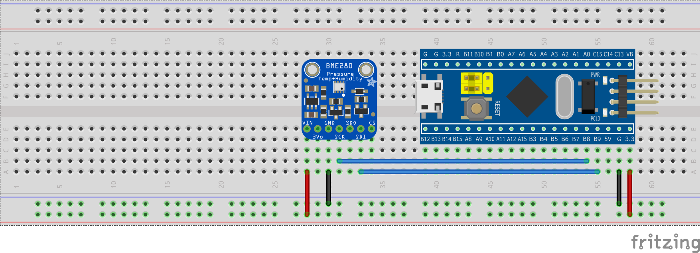

# Mbed library for BME280

Library was tested with STM32F103C8T6 + Mbed + PlatformIO + VSCode

## Tested with:
- Adafruit BME280 breakout
- Sparkfun BME280 breakout

First Header | Second Header
------------ | -------------
 | 

## Origin
Originally, the library was copied from
https://os.mbed.com/users/Rhyme/code/BME280/

## Wiring

## Compatibility
**Theoretically**, compatible with:
- GYBMEP
- GY-BME280-5V
- GY-BME/P280
